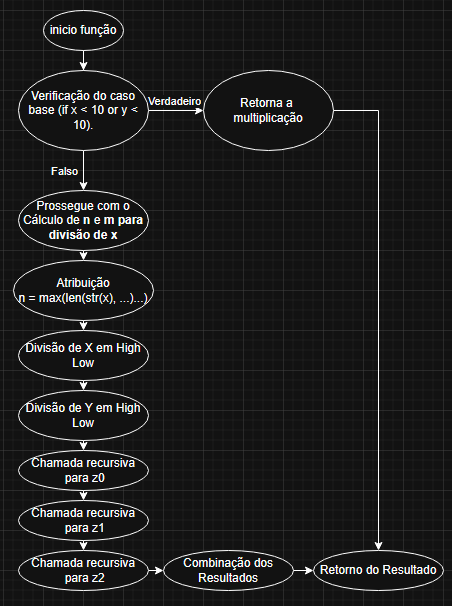

# Implementação do Algoritmo de Karatsuba

## Descrição do Projeto
Este projeto implementa o algoritmo de Karatsuba para multiplicação eficiente de dois números inteiros. O algoritmo reduz a complexidade da multiplicação tradicional de O(n²) para O(n^log₂3), tornando-se mais eficiente para números grandes.

## Como o Algoritmo Funciona
O algoritmo de Karatsuba divide os números de entrada em metades e realiza multiplicações menores recursivamente, combinando os resultados para obter o produto final.

### Passo a Passo da Implementação
1. Se um dos números for de um único dígito, realiza a multiplicação diretamente.
2. Divide os números em duas partes: alta e baixa.
3. Calcula três produtos recursivamente:
   - z0: multiplicação das partes baixas.
   - z1: multiplicação da soma das partes altas e baixas.
   - z2: multiplicação das partes altas.
4. Combina os resultados para formar o produto final.

## Como Executar o Projeto
### Pré-requisitos
- Python 3 instalado.

### Passos para Execução
1. Clone este repositório:
   ```bash
   git clone https://github.com/GustavoMBarbosa/Trabalho_individual_1_FPAA.git
   ```
2. Acesse o diretório do projeto:
   ```bash
   cd karatsuba-multiplication
   ```
3. Execute o script:
   ```bash
   python main.py
   ```
4. Insira dois números inteiros quando solicitado e visualize o resultado da multiplicação.

## Relatório Técnico

### Complexidade Ciclomática
A complexidade ciclomática mede a quantidade de caminhos independentes no código:
- Número de nós (N): total de blocos de código (função principal e recursões).
- Número de arestas (E): conexões entre os blocos de código.
- Fórmula: M = E - N + 2P (onde P = 1, pois temos um único componente conectado).

Para este algoritmo, a recursão adiciona novos caminhos ao fluxo de controle, aumentando sua complexidade.

### Complexidade Assintótica
A complexidade do algoritmo de Karatsuba é O(n^log₂3) ≈ O(n^1.58), sendo mais eficiente que a multiplicação tradicional O(n²), especialmente para números grandes.

### Melhor caso:
Ocorre quando os números têm poucos dígitos e a multiplicação difeta é usada, resultando em O(1).

### Médio caso:
Na maioria dos casos, a recursao divide os números em partes menores, resultando em O (n^log₂3).

### Pior caso:
Quando os números são grandes e a recursão se aprofunda ao máximo, mantendo a complexidade O(n^log₂3), mas com maior impacto na memória e chamadas recursivas.

## Diagrama de Fluxo


## Conclusão
Este projeto demonstra como a recursão e a divisão e conquista podem otimizar operações matemáticas complexas. O algoritmo de Karatsuba é um exemplo clássico de melhoria na eficiência computacional para multiplicações de grandes números.

